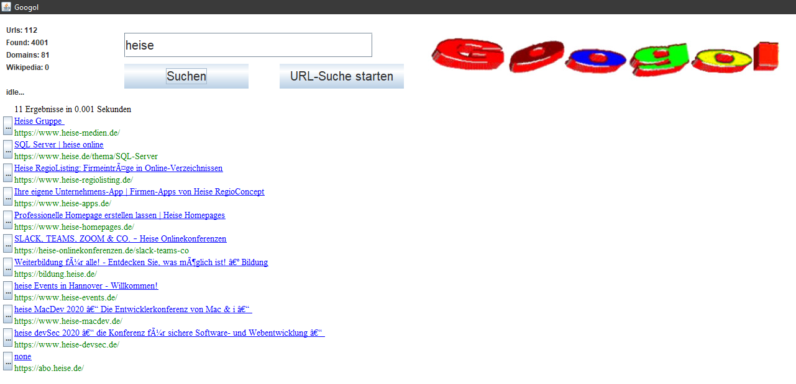

# Googol (April 2019)
This is a web-crawler combined with a search engine.
<br>*by Elias Theis ([@eliastheis](https://github.com/eliastheis))*

## How it works
In the ```data.db``` (sqlite-database) are a few starting URLs to crawl the web. Any new URL will be added to this list.
You can use the search-textbox to lookup any keywords, ranked by title, domain and URL. The buttons on the left will open the corresponding link in your browser.

## Start your own search-engine
Execute the main-method from ```/src/main/Main.java```

## Screenshot

